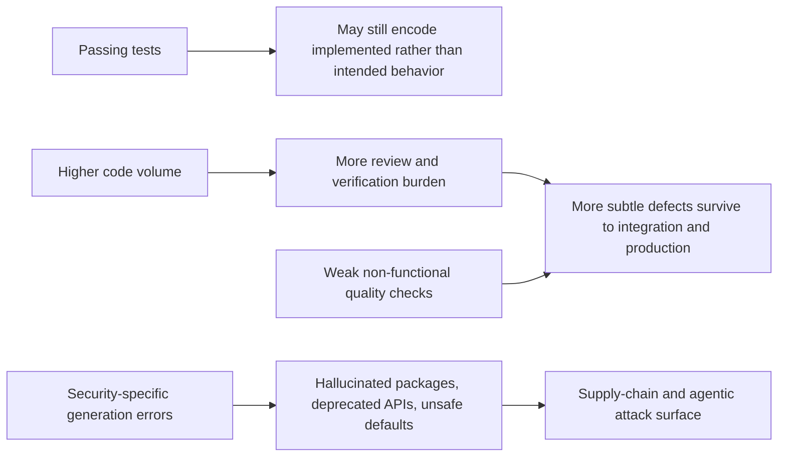

# Audit of the pasted research brief

[Download this report as Markdown](sandbox:/mnt/data/pasted_text_deep_research_report.md)

## Executive summary

The pasted text is a strong, unusually disciplined research brief. Its best-supported claims are the ones about security, supply-chain risk, verification burden, and maintainability drift. The external evidence is especially strong that large language model code generation can introduce known security flaws, hallucinated dependencies, deprecated API usage, duplicated code, and review bottlenecks that are not visible from syntax correctness alone. The brief is also right to distrust test suites as sole evidence of correctness: recent software-testing research shows that LLM-generated test oracles often track actual implementation behavior rather than intended behavior, which can let buggy logic survive behind passing tests. citeturn18view0turn18view4turn23view3turn22view0turn16view4turn20view1turn17view3

Where the brief overreaches is in treating all listed failure modes as equally established and equally AI-specific. Some claims are high confidence, such as package hallucinations and security weaknesses. Others are only medium confidence, such as the broad claim that AI-generated code systematically omits the entire set of non-functional concerns listed in the prompt. Still others are plausible but weakly evidenced as distinctively AI-specific, especially the claim that incidents are harder to triage because nobody owns a mental model of the system. There is meaningful contradictory evidence too: a randomized controlled trial from entity["company","GitHub","code hosting platform"] found modest improvements in functionality, readability, maintainability, and approval rates for code authored with GitHub Copilot in a constrained endpoint-building task, even as large-scale real-world and security-focused studies from entity["company","GitClear","engineering analytics"], entity["company","Veracode","application security"], and entity["company","Sonar","code quality platform"] point in the opposite direction for duplication, security, and verification at scale. The right correction is not “AI code is bad,” but “AI code changes the defect profile, particularly where production-readiness, security, and independent verification are weak.” citeturn16view1turn17view3turn18view0turn20view1turn16view7

## Scope and text framing

The uploaded text is an undated prompt for producing an “AI-Built Project Audit Spec,” not a factual report. Its context is therefore partly unspecified: it does not identify a target codebase, application class, deployment environment, or threat model. That matters, because some proposed checks are universal software engineering concerns, while others are much more relevant to agentic tooling, low-code app builders, or dependency-heavy web stacks.

The brief nevertheless has three notable strengths. First, it explicitly prioritizes primary and official sources, including academic work, engineering research, developer surveys, and security reports. Second, it asks for concrete detection heuristics rather than generic best practices. Third, it includes a valuable methodological guardrail: if a claim cannot be sourced, mark it as heuristic. That instruction is well aligned with the current evidence base, which is strongest for measurable code and security properties and weaker for sociotechnical claims about ownership, system understanding, and incident response.

## Claim verification matrix

| Key claim from pasted text | Support inside pasted text | External verification | Assessment | Confidence |
|---|---|---|---|---|
| AI-built applications can pass tests yet still fail in production because models optimize for test-passing rather than correctness. | Lines 9 and 18–22 emphasize “test-passing rather than correctness,” tautological tests, over-mocking, snapshot tests with no assertions, and high line coverage with low behavior coverage. | A controlled study found LLM-generated test oracles are prone to capturing actual implemented behavior rather than expected behavior, with overall oracle correctness below 50%, implying that passing generated tests may not demonstrate intended correctness. A separate 2026 survey-based analysis found 61% of developers say AI often produces code that “looks correct but isn’t reliable.” citeturn16view4turn20view1 | Substantially validated, but the strongest evidence is about oracle bias and deceptive plausibility, not a proven universal optimization objective. | High |
| AI-generated code commonly omits non-functional concerns such as validation, authz, error handling, logging, observability, idempotency, and transaction boundaries. | Line 10 and lines 19–24 list these omissions across security, reliability, operability, and data integrity. | A 2026 Journal of Systems and Software study found a persistent gap between code that passes tests and code that “passes with quality,” and reported that practitioners prioritize maintainability and readability while many non-functional quality attributes remain understudied. Veracode’s longitudinal benchmark found only 55% of generations secure, despite syntax correctness above 95%. citeturn21view0turn21view2turn18view3turn18view4 | Directionally validated, but the bundle is too broad. Security and some reliability concerns are well supported; the full checklist of omissions is partly heuristic. | Medium-high |
| AI-generated code is more verbose, duplicated, inconsistent, and structured around plausible patterns rather than domain truth. | Line 11 explicitly frames this as the “GitClear effect.” | GitClear’s 2020–2024 repository analysis found declines in refactoring-associated moved code and rising copy-pasted code, with cloned lines rising from 8.3% to 12.3% while refactoring-associated changed lines fell from 25% in 2021 to under 10% in 2024. A 2025 large-scale comparative study found AI-generated code is generally simpler and more repetitive. A real-world PR study reported 1.7x more issues overall in AI-coauthored pull requests. citeturn17view3turn17view4turn25view1turn16view7 | Well supported as a real risk pattern, though not universal and not a formally standardized “effect.” | High |
| Human engineers struggle to triage incidents because no one holds a mental model of the system and rationale is weakly documented. | Line 12 and lines 23 and 52–55 connect poor system understanding to operations and remediation. | Evidence is indirect rather than definitive. Sonar reports a verification bottleneck, low trust, and higher review effort; the 2025 and 2026 entity["organization","Stack Overflow","developer survey"] surveys show distrust of AI output and limited confidence on complex tasks; practitioner guidance from entity["people","Simon Willison","software writer"] repeatedly emphasizes that humans must prove and understand changes. citeturn20view1turn19view0turn19view1turn26view0turn26view1 | Plausible and important, but not strongly established as a distinct AI-specific causal claim. | Medium |
| Security and supply-chain risks are elevated through hallucinated packages, outdated APIs, unsafe defaults, secrets in code, and prompt-injection-exposed agentic features. | Lines 13 and 19–24 make this one of the brief’s clearest concerns. | This is the best-supported part of the brief. A USENIX Security paper found package hallucinations across 576,000 samples, with at least 5.2% hallucinated packages for commercial models and 21.7% for open-source models. An ICSE paper found deprecated API usage to be a measurable problem in LLM completions. Veracode found only 55% of generation tasks secure in Spring 2026, with security flat despite syntax gains. entity["organization","OWASP","application security"] ranks prompt injection as the leading GenAI application risk, and entity["organization","OpenAI","ai research lab"] has published current defensive guidance for agentic systems. A 2026 secrets-sprawl report also found roughly 2x higher secret leak rates in AI-assisted commits than the broader GitHub baseline. citeturn23view3turn22view0turn18view3turn18view4turn16view11turn16view10turn28search0turn28search1 | Strongly validated. This should remain central in any downstream audit spec. | High |

## Analytical synthesis

The strongest technical validation for the pasted text comes from three evidence streams that reinforce one another. The first is software-testing research: the problem is not simply that LLMs write weak tests, but that they can generate tests that faithfully encode existing behavior instead of intended behavior. That matters because it explains the prompt’s central fear that code can “pass” while still being wrong. The second is defect-shape research at scale: repository and pull-request studies repeatedly show more duplication, more issue volume, and distinct defect patterns in AI-authored or AI-assisted code. The third is security benchmarking: syntax keeps improving much faster than secure behavior, which means “works locally” and “looks production-ready” are increasingly poor proxies for safety. citeturn16view4turn17view3turn25view1turn16view7turn18view4

The diagram above reflects the broad causal picture supported by recent research: correctness failures, maintainability drift, and security risk do not arise from one single “AI bug,” but from a pipeline in which plausible code is generated faster than teams can independently validate intended behavior, production properties, and threat exposure. citeturn16view4turn20view1turn17view3turn18view4turn23view3turn22view0

The pasted text is especially persuasive on security. Package hallucination is no longer a fringe anecdote: the academic literature treats it as a software supply-chain problem with measurable prevalence. Deprecated API usage is also now directly studied rather than merely complained about. Prompt injection has moved from hypothetical risk to a mainstream design constraint for any agentic feature that mixes private data, untrusted content, and tool execution. On this dimension, the brief is correctly calibrated and should arguably sharpen its terminology: “slopsquatting” is vivid practitioner language, but “package hallucination” is the cleaner research term to anchor in the spec. citeturn23view3turn22view0turn16view11turn16view10

The maintainability claim is also largely borne out, though it needs one refinement. The prompt frames verbosity, duplication, inconsistent style, and weak abstraction as a unified “GitClear effect.” The evidence does support higher duplication and code churn, and at least one large-scale comparative study describes AI-generated code as simpler and more repetitive. But the phrase itself is not a standard research category, and the literature is not unanimous about readability or maintainability in every setting. In GitHub’s randomized trial, Copilot-assisted developers produced code that passed more tests and was rated slightly more readable, reliable, maintainable, and concise in a bounded task. That contradiction is important: AI assistance can help in narrow, well-scaffolded tasks, while still degrading long-horizon maintainability in broader repository ecosystems or when review is weak. citeturn17view3turn25view1turn16view1

The omitted-non-functional-concerns claim is directionally correct but should be broken apart in the downstream audit spec. Security omissions are strongly evidenced. Reliability omissions are common in practitioner reports and are consistent with the broader “passes tests but fails in production” pattern, but they are less often measured in one benchmarkable bundle. The best recent research on non-functional quality concludes that the literature itself is skewed toward security and performance, while practitioners worry most about maintainability and readability; it also shows prompt-based optimization of non-functional quality to be unstable. In other words, the brief is right to elevate non-functional properties, but it should not imply that each listed omission is equally established in the literature. citeturn21view0turn21view2turn18view3

The sociology-of-ownership claim is the weakest major claim, but it is still useful. There is plenty of developer sentiment showing distrust, shallow verification, and the sense that AI-generated code often only appears correct. There is also strong practitioner advice that the human must remain accountable for demonstrating and understanding changes. What is missing is a robust body of empirical studies directly linking AI-generated code to poorer incident triage because nobody owns a mental model. That does not make the claim false; it means the prompt should label it as a high-value heuristic rather than a settled finding. citeturn20view1turn19view0turn26view0turn26view1

Real-world incidents strengthen the brief’s practical relevance, but they need careful wording. Publicly documented examples involving entity["company","Replit","cloud ide"] and entity["company","Lovable","ai app builder"] show destructive autonomous actions, authentication failures, and unintended data exposure in AI-assisted or AI-native development environments. These incidents are useful exemplars of failure classes the brief wants to detect, but they should not be treated as prevalence studies. They show that the risk is real, not how often it occurs across all AI-built applications. citeturn29view0turn29view1turn16view8turn16view9

## Methodological assessment

The pasted brief is methodologically strongest where it asks for concrete, grep-able, code-local checks and weakest where it jumps from plausible sociotechnical narratives to generalized causal claims. The source mix it recommends is broadly appropriate, but each source family has specific biases that the downstream auditor should recognize.

Controlled vendor studies are useful for bounded-task capability, but they often test scaffolded scenarios. GitHub’s 2024 randomized trial had 202 experienced developers writing API endpoints and found modest quality gains with Copilot. That is valuable evidence, but it is not a production-repository audit. Repository-scale studies such as GitClear’s 211 million changed lines and a real-world PR study of 470 open-source pull requests capture different phenomena: long-run maintenance patterns, issue distributions, and review outcomes in the wild. Security benchmarks such as Veracode’s 80 tasks across multiple languages and more than 150 evaluated models capture still another dimension: safe-by-default behavior under realistic coding prompts. Surveys from Stack Overflow and Sonar reveal perception, trust, and workflow behavior rather than direct defect rates. The brief should therefore weight evidence by method, not merely by citation count. citeturn16view1turn17view3turn16view7turn18view3turn18view4turn19view0turn20view0

A second methodological concern is construct clarity. The brief uses “AI-generated,” “AI-built,” “vibe-coded,” and “agentic” almost interchangeably. Those are not the same thing. Code completion in an IDE, whole-file generation, autonomous agent editing, low-code AI app builders, and repository-level code review automation create different failure surfaces. The best correction is to separate the downstream audit spec into at least three evidence modes: AI-generated code artifacts, agentic tool execution behavior, and platform or workflow governance. Without that separation, the final spec will mix code smells, operational smells, and autonomy-control failures in a way that reduces diagnostic precision.

A third concern is confirmation bias. The prompt is explicitly framed around failure modes, which is reasonable for an audit spec, but the final artifact should acknowledge counterevidence. Some studies show quality improvements in constrained tasks, and some test-oracle research shows LLM-generated oracles can still achieve nontrivial mutation scores or outperform traditional generators on some dimensions. The most defensible downstream design is therefore not to assume AI-authored code is bad, but to assign higher prior scrutiny to defect classes that the current evidence shows are disproportionately risky. citeturn16view1turn24search12turn16view4

## Conclusions and recommendations

The pasted text is credible as a research brief, but it should be tightened before becoming a downstream audit specification.

First, keep the security, supply-chain, and verification-gap claims central. Those are the most evidence-backed parts of the document, and they align with both academic and operational evidence. citeturn23view3turn18view4turn20view1

Second, split “non-functional concerns” into evidence tiers. Security and some production-readiness checks should be marked evidence-backed. Broader items such as observability gaps, idempotency omissions, and weak transaction boundaries should be retained, but labeled as high-value heuristics unless the final spec attaches source support per item. citeturn21view0turn21view2

Third, revise the maintainability claim from a blanket indictment to a risk-weighted statement. The evidence supports more duplication, more repetitive structure, and more downstream review cost, but not an absolute rule that AI-authored code is always less readable or less maintainable in every context. citeturn17view3turn25view1turn16view1

Fourth, downgrade the “no one holds a mental model” claim from asserted fact to explicitly labeled heuristic. It is useful for auditing distressed codebases, but the direct empirical base is thinner than the prompt implies. citeturn20view1turn19view0turn26view0

Fifth, add one explicit instruction that the final audit spec should distinguish between “AI-specific smell,” “generic software smell amplified by AI,” and “platform or autonomy-control failure.” That single change would make the downstream auditor far more precise and reduce false positives.

Overall judgment: the pasted brief is rigorous in intent, mostly well calibrated on security and maintainability, somewhat overstated on sociotechnical ownership failure, and strongest when translated into independent behavioral checks rather than broad narratives.

## Open questions and limitations

Direct, peer-reviewed evidence for several items remains sparse. In particular, there is still limited empirical work that cleanly measures how often AI-generated applications omit runbooks, ADRs, threat models, rollback plans, or other operational documentation compared with human-led projects. Public incident reports are growing, but many remain anecdotal, vendor-mediated, or reported through news and incident databases rather than full engineering postmortems. There is also no single consensus dataset that separates AI-assisted from AI-authored code with perfect reliability in the wild. Those are reasons to keep some checks in the final spec, but to mark them as heuristics where necessary rather than overstate certainty.

## Source list

The sources below are the ones relied on directly in this report. Citations are clickable.

- “Do LLMs generate test oracles that capture the actual or the expected program behaviour?” citeturn16view4turn3search8
- “Quality Assurance of LLM-generated Code: Addressing Non-Functional Quality Characteristics.” citeturn21view0turn21view2
- “LLMs Meet Library Evolution: Evaluating Deprecated API Usage in LLM-based Code Completion.” citeturn22view0
- “We Have a Package for You! A Comprehensive Analysis of Package Hallucinations by Code Generating LLMs.” citeturn23view3
- GitHub research, “Does GitHub Copilot improve code quality? Here’s what the data says.” citeturn16view1
- GitClear research, “AI Copilot Code Quality: 2025 Look Back at 12 Months of Data.” citeturn17view3turn17view4
- “AI vs human code gen report: AI code creates 1.7x more issues.” citeturn16view7
- Sonar press release on the 2026 verification gap. citeturn20view0
- Sonar blog, “The AI trust gap: Why code verification matters.” citeturn20view1
- Stack Overflow Developer Survey 2025, AI section. citeturn19view0
- Stack Overflow Developer Survey 2024, AI section. citeturn19view1
- Veracode, “We Asked 100+ AI Models to Write Code. Here’s How Many Failed Security Tests.” citeturn18view0
- Veracode, “Spring 2026 GenAI Code Security Update.” citeturn18view3turn18view4
- OWASP GenAI Security Project, LLM01:2025 Prompt Injection. citeturn16view11
- OpenAI, “Designing AI agents to resist prompt injection.” citeturn16view10
- 2026 secrets-sprawl report and related summary on AI-assisted credential leakage. citeturn28search0turn28search1
- Simon Willison, “Here’s how I use LLMs to help me write code.” citeturn26view1
- Simon Willison, “Your job is to deliver code you have proven to work.” citeturn26view0
- Simon Willison, “The lethal trifecta for AI agents: private data, untrusted content, and external communication.” citeturn26view2
- Incident database entry on the 2025 Replit destructive-agent incident. citeturn29view0
- Reporting on the 2025 Replit incident in Fortune. citeturn29view1
- Wiz write-up on an authentication vulnerability in an AI app-building platform. citeturn16view8
- Lovable’s April 2026 incident response. citeturn16view9